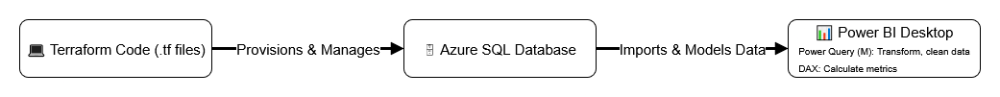

# Coffee Vending Machine - Sales Analytics Dashboard

### What 🔎 
Interactive sales analytics dashboard for a coffee vending business—surfacing sales performance, product mix, customer behavior, and peak hours in a clean, decision-ready Power BI report.

### How ⚙️  
Kaggle coffee sales data is loaded into an **Azure SQL Database** provisioned via **Terraform IaC**; **Power Query** handles ETL and **DAX** defines measures and KPIs. The report connects directly to Azure SQL with secure firewall rules (client IP allowlist) and supports scheduled/near-real-time refresh for cloud-hosted, shareable insights.

### Why 💡  
Replaces manual spreadsheets with a single, trusted source of truth—faster decisions on merchandising and inventory, visibility into payment trends, and clear peak-hour planning.

### Techstack 🧰  
Power BI (**Power Query**, **DAX**), **Azure SQL Database**, **Terraform** (azurerm provider), Resource Group + SQL Server + Database + Firewall rule (AllowMyIP), direct SQL connections, Power BI Service (cloud-hosted reporting), Kaggle dataset, scheduled refresh.


 <!-- create this screenshot later -->

## 📊 Insights

- On average, the coffee vending machine generates over **300 Ukrainian hryvnias in revenue per day**, equaling around 10 coffee sales.
- **"Latte"** and **"Americano with milk"** are the top-selling products, accounting for over **45% of total sales**.
- Card payments are used in over **95% of transactions**, indicating that the cash payment option is a low-priority feature.


## 🛠️ Tech Stack



- **Data Source:** [Coffee Vending Machine Sales Kaggle Dataset](https://www.kaggle.com/datasets/ihelon/coffee-sales?resource=download)
- **Data Transformation & Modeling:** Power BI (Power Query & DAX)
- **Data Warehouse:** Azure SQL Database
- **Reporting & Visualization:** Power BI Desktop & Power BI Service
- **Infrastructure as Code:** Terraform
- **Cloud Platform:** Microsoft Azure

## 🚀 Usage

To run this project locally, you will need the following tools installed:

- [Power BI Desktop](https://powerbi.microsoft.com/en-us/desktop/)
- [Terraform](https://www.terraform.io/downloads.html)
- [Azure CLI](https://docs.microsoft.com/en-us/cli/azure/install-azure-cli)
- An active [Azure Subscription](https://azure.microsoft.com/en-us/free/)
- [Azure Data Studio](https://learn.microsoft.com/en-us/sql/azure-data-studio/download-azure-data-studio?view=sql-server-ver16)

### View the interactive dashboard

Open the Power BI file: `/powerbi/coffee-vending-sales-dashboard.pbix` in Power BI Desktop.

### Setting up the project


#### 1. Set Up the Cloud Infrastructure

The Terraform code in the `/terraform` directory will provision the necessary Azure SQL Database.

```bash
# 1. Navigate to the terraform directory
cd terraform

# 2. Create a terraform.tfvars file and add your credentials
# (See terraform/variables.tf for required variables)
# IMPORTANT: DO NOT commit this file to Git.
echo 'sql_admin_login = "youradmin"' > terraform.tfvars
echo 'sql_admin_password = "yourpassword"' >> terraform.tfvars

# 3. Initialize Terraform
terraform init

# 4. Plan the deployment to see what will be created
terraform plan

# 5. Apply the plan to create the resources in Azure
terraform apply
```

#### 2. Upload Data to Azure SQL

Once the database is created, you will need to upload the source CSV data. This can be done using the "[Import Flat File](https://learn.microsoft.com/en-us/azure-data-studio/extensions/sql-server-import-extension)" wizard in Azure Data Studio.

#### 3. Configure the Power BI Report

1.  Open the Power BI file: `/powerbi/coffee-vending-sales-dashboard.pbix`.
2.  Go to **Transform data** -> **Advanced Editor**.
3.  Change the data source to the Azure SQL Database you created with Terraform.
4.  Enter your database credentials when prompted.
5.  Click **"Refresh"** to load the data from Azure into the report.


#### 4. Cleaning Up

To avoid ongoing Azure costs, you can destroy the infrastructure when you are finished.

```bash
# Navigate to the terraform directory
cd terraform

# Destroy all resources managed by this configuration
terraform destroy
```
